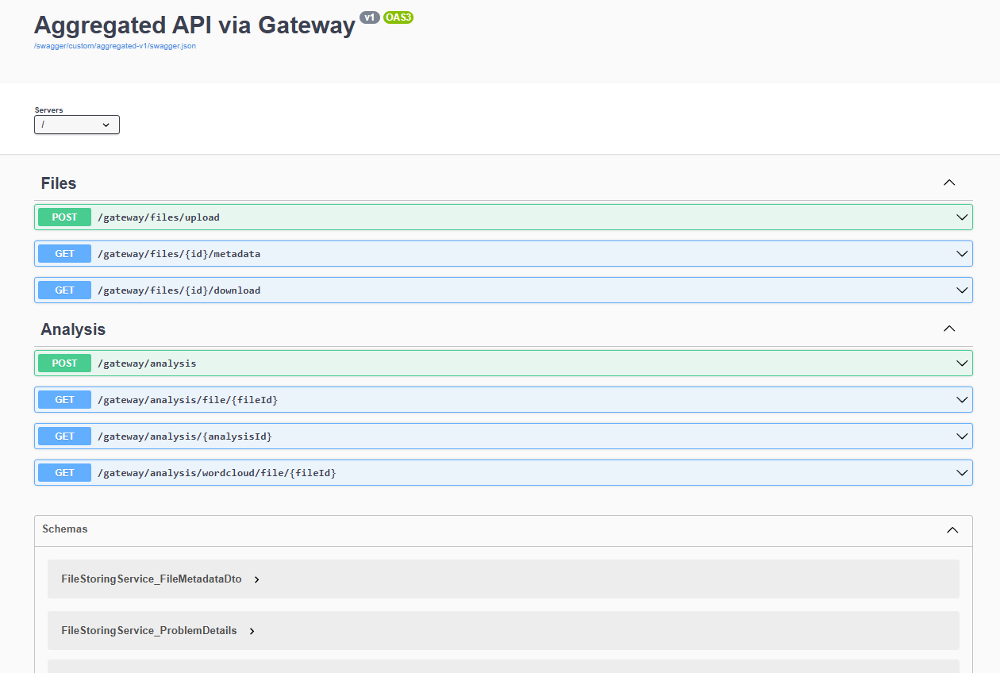
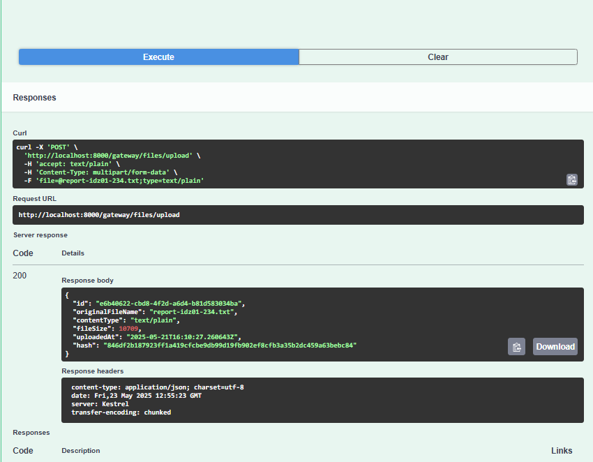
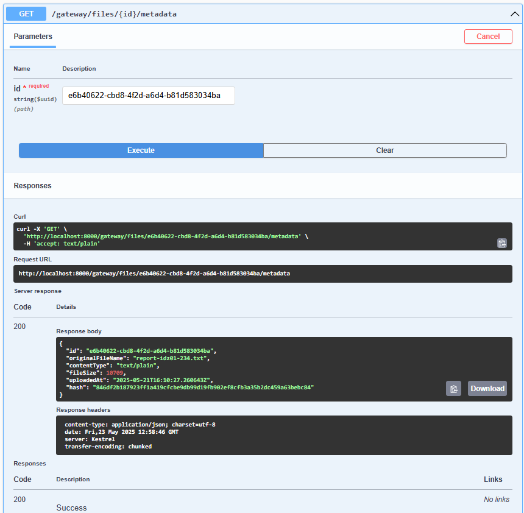
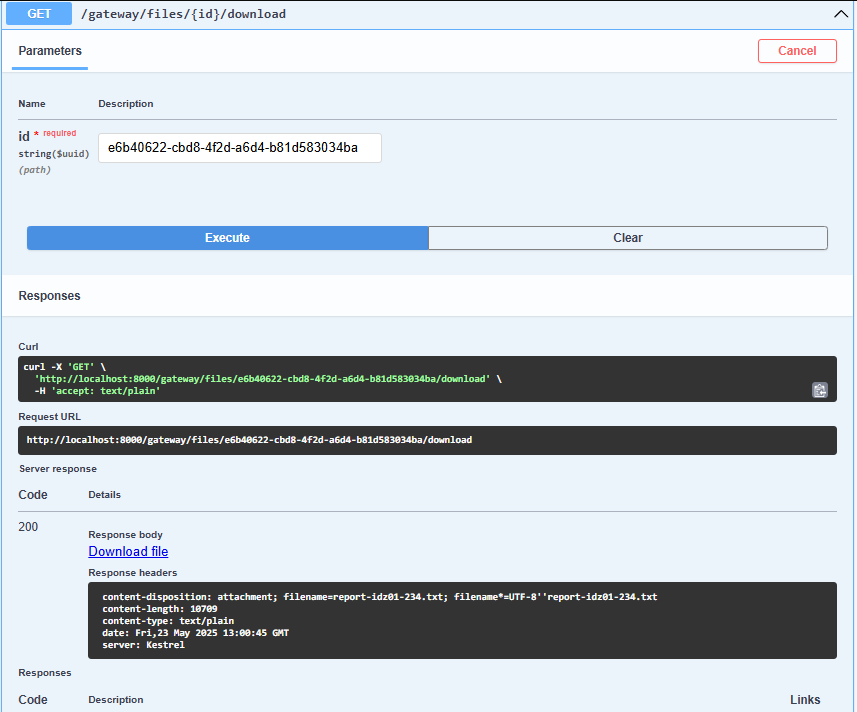
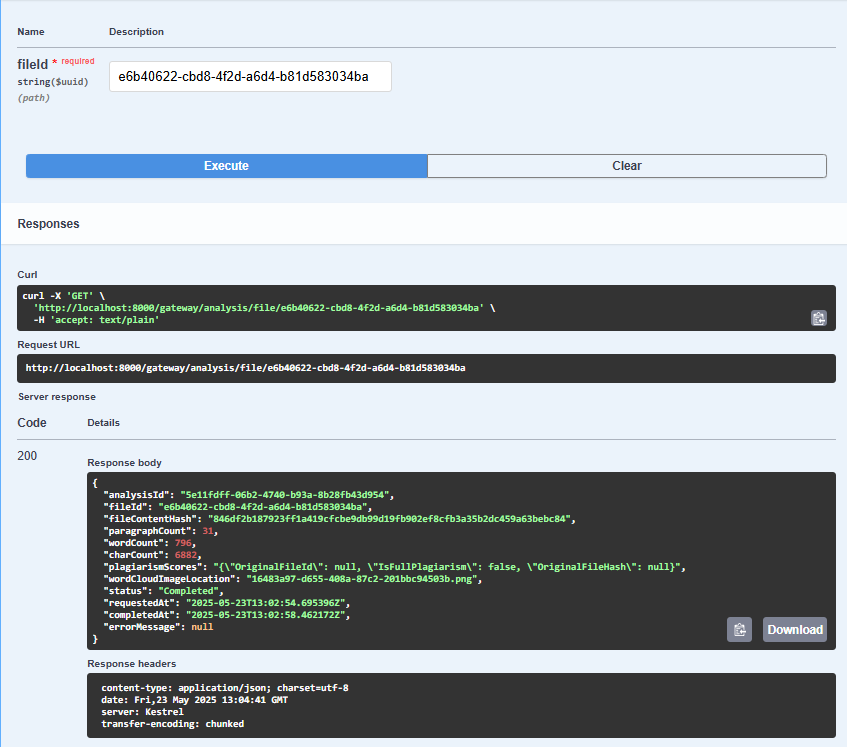
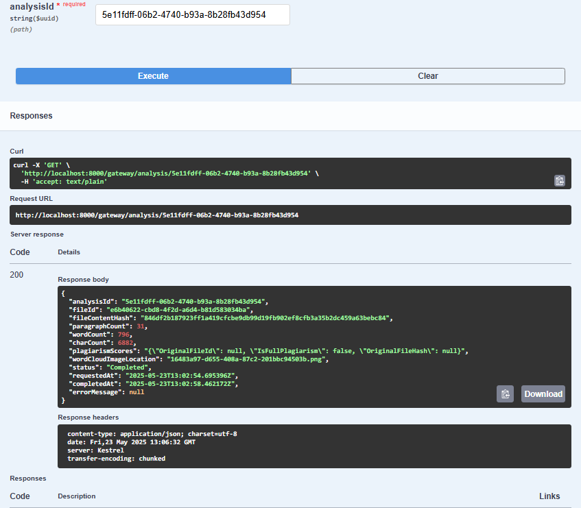
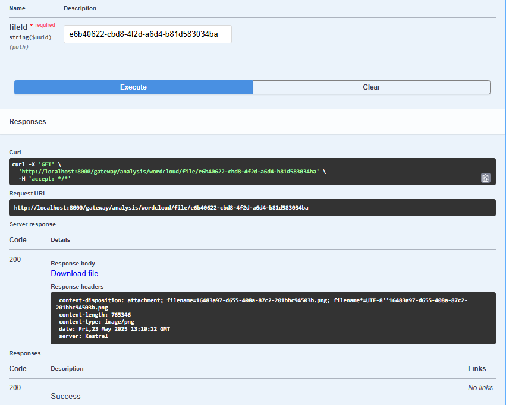

# By Пономарев Николай Юрьевич from БПИ-234
# КР-2

## 1. Архитектура системы

Система состоит из следующих основных компонентов (микросервисов):

1.  **API Gateway**: Единая точка входа для всех клиентских запросов. Маршрутизирует запросы к соответствующим внутренним сервисам. Реализован с использованием YARP.
2.  **File Storing Service**: Отвечает за загрузку, хранение и предоставление доступа к файлам отчетов.
3.  **File Analysis Service**: Выполняет анализ текстовых файлов, включая подсчет статистики, определение плагиата и генерацию облака слов. Хранит результаты анализа и предоставляет к ним доступ.

Взаимодействие между сервисами осуществляется синхронно через HTTP запросы. Для хранения метаданных файлов и результатов анализа используются базы данных PostgreSQL, настроенные в `docker-compose.yml`.

### Схема взаимодействия

* **Загрузка файла**:
    1.  Клиент отправляет запрос на загрузку файла (`.txt`) на API Gateway (`/gateway/files/upload`).
    2.  API Gateway перенаправляет запрос на `POST /api/files/upload` в File Storing Service.
    3.  File Storing Service вычисляет SHA256 хэш файла.
    4.  Если файл с таким хэшем уже существует в БД, сервис возвращает метаданные существующего файла (`200 OK`).
    5.  Если файла нет, он сохраняется в файловом хранилище (путь определяется `FileStorage__BasePath`), а его метаданные (ID, имя, MIME-тип, хэш, путь к сохраненному файлу, размер, дата загрузки) сохраняются в PostgreSQL (`StoredFiles` таблица).
    6.  Сервис возвращает метаданные нового файла (`201 Created`).

* **Анализ файла**:
    1.  Клиент отправляет запрос на анализ файла (`AnalysisRequestDto`, содержащий `FileId` и `FileHash`) через API Gateway (`/gateway/analysis`) на `POST /api/analysis` в File Analysis Service.
    2.  API Gateway перенаправляет запрос File Analysis Service.
    3.  File Analysis Service проверяет:
        * Если `ForceReanalyze` установлено в `false` и для данного `FileId` уже существует завершенный анализ (`Status == AnalysisStatus.Completed`), возвращаются существующие результаты (`200 OK`).
        * Если `ForceReanalyze == true`, существующий результат анализа для `FileId` удаляется из БД.
    4.  Если необходимо провести новый анализ, вызывается `FileAnalysisOrchestratorService`. Оркестратор:
        * Запрашивает содержимое файла у `FileStoringService` по `FileId` (через `FileStoringServiceClient`).
        * Выполняет подсчет статистики (абзацы, слова, символы) с помощью `TextStatisticsService`.
        * Определяет плагиат, сравнивая `FileContentHash` с записями в `AnalysisResult` (через `PlagiarismDetectionService`).
        * Запрашивает генерацию облака слов у внешнего API (`https://quickchart.io/wordcloud`) через `WordCloudApiClient`. Полученное изображение сохраняется локально в `FileAnalysisService` (путь определяется `FileStorageForAnalysis__BasePath`) с помощью `LocalFileStorageProvider`.
    5.  Результаты анализа (статистика, данные о плагиате, путь к изображению облака слов, статус) сохраняются в PostgreSQL (`AnalysisResult` таблица).
    6.  Результаты анализа (`AnalysisResultDto`) возвращаются клиенту. Если анализ еще выполняется, возвращается статус `202 Accepted`. При ошибке - `500 Internal Server Error`.

* **Получение файла**:
    1.  Клиент запрашивает файл по ID через API Gateway (`/gateway/files/{id}/download`).
    2.  API Gateway перенаправляет запрос на `GET /api/files/{id}/download` в File Storing Service.
    3.  File Storing Service находит метаданные файла по ID, получает файл из хранилища по `StoredFileName` и возвращает его содержимое.

* **Получение облака слов**:
    1.  Клиент запрашивает изображение облака слов по ID файла через API Gateway (`/gateway/analysis/wordcloud/file/{fileId}`).
    2.  API Gateway перенаправляет запрос на `GET /api/analysis/wordcloud/file/{fileId}` в File Analysis Service.
    3.  File Analysis Service находит завершенный результат анализа для `fileId`, извлекает `WordCloudImageLocation` и возвращает изображение из своего локального хранилища.

---
## 2. Компоненты Системы

### 2.1. API Gateway

* **Назначение**: Обеспечивает единую точку входа и маршрутизацию запросов.
* **Технологии**: YARP, конфигурация через `appsettings.json`.
* **Основные маршруты** (из `appsettings.json`):
    * `FileStoringService` (кластер `filestoring_cluster`):
        * `/gateway/files/upload` -> `/api/files/upload`
        * `/gateway/files/{fileId}/metadata` -> `/api/files/{fileId}/metadata`
        * `/gateway/files/{fileId}/download` -> `/api/files/{fileId}/download`
    * `FileAnalysisService` (кластер `fileanalysis_cluster`):
        * `POST /gateway/analysis` -> `/api/analysis`
        * `GET /gateway/analysis/file/{fileId}` -> `/api/analysis/file/{fileId}`
        * `GET /gateway/analysis/{analysisId}` -> `/api/analysis/{analysisId}`
        * `GET /gateway/analysis/wordcloud/file/{fileId}` -> `/api/analysis/wordcloud/file/{fileId}`

#### Скриншоты Swagger для API Gateway

Swagger UI для API Gateway агрегирует спецификации двух сервисов, доступный по адресу `http://localhost:8000/swagger` после запуска):
* File Storing Service
* File Analysis Service

---
### 2.2. File Storing Service

* **Назначение**: Управление файлами отчетов.
* **Технологии**: ASP.NET Core Web API, Entity Framework Core, PostgreSQL, локальное файловое хранилище.
* **Структура таблицы `StoredFiles` (модель `StoredFile.cs`)**:
    * `Id` (Guid): PK, уникальный идентификатор файла.
    * `OriginalFileName` (string, MaxLength 255): Оригинальное имя файла.
    * `ContentType` (string, MaxLength 100): MIME-тип файла.
    * `Hash` (string, MaxLength 64): SHA256 хэш содержимого файла.
    * `StoredFileName` (string, MaxLength 1024): Имя файла в локальном хранилище.
    * `FileSize` (long): Размер файла в байтах.
    * `UploadedAt` (DateTime): Дата и время загрузки.
* **DTO `FileMetadataDto.cs`**:
    * `Id` (Guid)
    * `OriginalFileName` (string)
    * `ContentType` (string)
    * `FileSize` (long)
    * `UploadedAt` (DateTime)
    * `Hash` (string)
* **Основные API Endpoints (`FilesController.cs`)**:
    * `POST /api/files/upload`: Загрузка файла (`IFormFile`).
        * Принимает: `IFormFile file`. Ограничение: только `.txt` файлы.
        * Возвращает: `201 Created` с `FileMetadataDto` при успешном создании нового файла, или `200 OK` с `FileMetadataDto` если файл с таким хэшем уже существует. `400 BadRequest` при ошибках валидации.
    * `GET /api/files/{id}/metadata`: Получение метаданных файла.
        * Принимает: `Guid id`.
        * Возвращает: `200 OK` с `FileMetadataDto`. `404 NotFound` если файл не найден.
    * `GET /api/files/{id}/download`: Скачивание файла.
        * Принимает: `Guid id`.
        * Возвращает: `FileStreamResult` (`200 OK`). `404 NotFound` если файл или его метаданные не найдены.

#### Скриншоты Swagger для Api Gateway Service, который перенаправляет запросы в описанный выше микросервис, Swagger Ui для этого сервиса отдельно будет доступен по ссылке `http://localhost:8001/swagger`

* **Загрузка файла (`POST /gateway/files/upload`):**

  

* **Получение метаданных файла (`GET /gateway/files/{id}/metadata`):**

  

* **Скачивание файла (`GET /gateway/files/{id}/download`):**

  
---
### 2.3. File Analysis Service

* **Назначение**: Анализ текстового контента файлов.
* **Технологии**: ASP.NET Core Web API, Entity Framework Core, PostgreSQL, HTTP клиенты (`FileStoringServiceClient`, `WordCloudApiClient`), локальное хранилище для облаков слов.
* **Структура таблицы `AnalysisResult` (модель `AnalysisResult.cs`)**:
    * `Id` (Guid): PK, уникальный идентификатор результата анализа.
    * `FileId` (Guid): Идентификатор файла из `FileStoringService`.
    * `FileContentHash` (string, MaxLength 64): Хэш содержимого файла на момент анализа.
    * `ParagraphCount` (int): Количество абзацев.
    * `WordCount` (int): Количество слов.
    * `CharCount` (int): Количество символов.
    * `PlagiarismScores` (string?, `jsonb`): Результаты проверки на плагиат (например, ID оригинального файла, если найден 100% дубликат по хэшу).
    * `WordCloudImageLocation` (string?): Путь к сохраненному изображению облака слов в локальном хранилище сервиса анализа.
    * `Status` (`AnalysisStatus` enum: Pending, InProgress, Completed, Failed): Текущий статус анализа.
    * `RequestedAt` (DateTime): Дата и время запроса анализа.
    * `CompletedAt` (DateTime?): Дата и время завершения анализа.
    * `ErrorMessage` (string?): Сообщение об ошибке, если анализ не удался.
* **DTOs**:
    * **`AnalysisRequestDto.cs`**:
        * `FileId` (Guid, Required)
        * `FileHash` (string, Required)
        * `ForceReanalyze` (bool, default: `false`)
    * **`AnalysisResultDto.cs`**:
        * `AnalysisId` (Guid)
        * `FileId` (Guid)
        * `FileContentHash` (string)
        * `ParagraphCount` (int)
        * `WordCount` (int)
        * `CharCount` (int)
        * `PlagiarismScores` (string?)
        * `WordCloudImageLocation` (string?)
        * `Status` (string)
        * `RequestedAt` (DateTime)
        * `CompletedAt` (DateTime?)
        * `ErrorMessage` (string?)
* **Основные API Endpoints (`AnalysisController.cs`)**:
    * `POST /api/analysis`: Запрос на анализ файла.
        * Принимает: `[FromBody] AnalysisRequestDto request`.
        * Возвращает: `AnalysisResultDto`. `200 OK` если анализ уже завершен и `ForceReanalyze` = `false`, или если анализ завершился синхронно. `202 Accepted` если анализ запущен асинхронно (статус `InProgress` или `Pending`). `400 BadRequest` при невалидном запросе. `500 InternalServerError` при ошибках.
    * `GET /api/analysis/file/{fileId}`: Получение результатов анализа по `FileId`.
        * Принимает: `Guid fileId`.
        * Возвращает: `200 OK` с `AnalysisResultDto`. `404 NotFound` если результат не найден.
    * `GET /api/analysis/{analysisId}`: Получение результатов анализа по `AnalysisId`.
        * Принимает: `Guid analysisId`.
        * Возвращает: `200 OK` с `AnalysisResultDto`. `404 NotFound` если результат не найден.
    * `GET /api/analysis/wordcloud/file/{fileId}`: Получение изображения облака слов для файла.
        * Принимает: `Guid fileId`.
        * Возвращает: Изображение (`FileStreamResult`, `200 OK`). `404 NotFound` если анализ не завершен, облако не создано или файл не найден.

#### Скриншоты Swagger для Api Gateway Service, который перенаправляет запросы в описанный выше микросервис, Swagger Ui для этого сервиса отдельно будет доступен по ссылке `http://localhost:8002/swagger`

* **Запрос на анализ файла (`POST /gateway/analysis/file/{fileId}`):**

  

* **Получение результатов анализа по ID файла (`GET /gateway/analysis/file/{fileId}`):**

  

* **Получение результатов анализа по ID анализа (`GET /gateway/analysis/{analysisId}`):**

  
* **Получение облака слов (`GET /gateway/analysis/wordcloud/file/{fileId}`):**

  
  
---
## 3. Docker и Запуск Проекта

Проект использует Docker и Docker Compose для развертывания и запуска сервисов и баз данных.
Конфигурация `docker-compose.yml` включает:
* `apigateway`: API шлюз, порт `8000:8080`.
* `filestoringservice`: Сервис хранения файлов, порт `8001:8080`.
    * `ConnectionStrings__AppDatabase`: Подключение к `db_filestoring`.
    * `FileStorage__BasePath`: `/app/storage` (том `filestoring_files_data`).
* `fileanalysisservice`: Сервис анализа файлов, порт `8002:8080`.
    * `ConnectionStrings__AppDatabase`: Подключение к `db_fileanalysis`.
    * `ServiceUrls__FileStoringService`: `http://filestoringservice:8080`.
    * `FileStorageForAnalysis__BasePath`: `/app/analysis_storage` (том `analysis_files_data`) для хранения облаков слов.
    * `WordCloudApi__BaseUrl`: `https://quickchart.io/wordcloud`.
* `db_filestoring`: PostgreSQL для `FileStoringService`, порт `5433:5432`.
* `db_fileanalysis`: PostgreSQL для `FileAnalysisService`, порт `5434:5432`.

Запуск: `docker-compose up --build` в корне проекта.

---
## 4. Тестирование

Проект включает юнит-тесты:
* `FileStoringService.Tests`: содержит `LocalFileStorageProviderTests.cs`.
* `FileAnalysisService.Tests`: содержит `TextStatisticsServiceTests.cs` и `WordCloudServiceTests.cs`.
---
