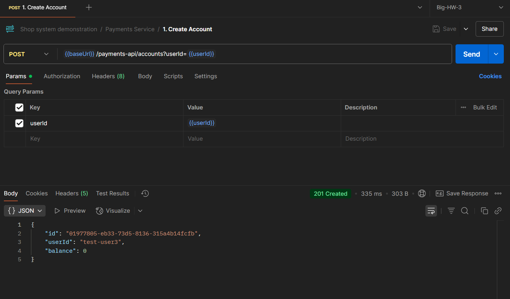
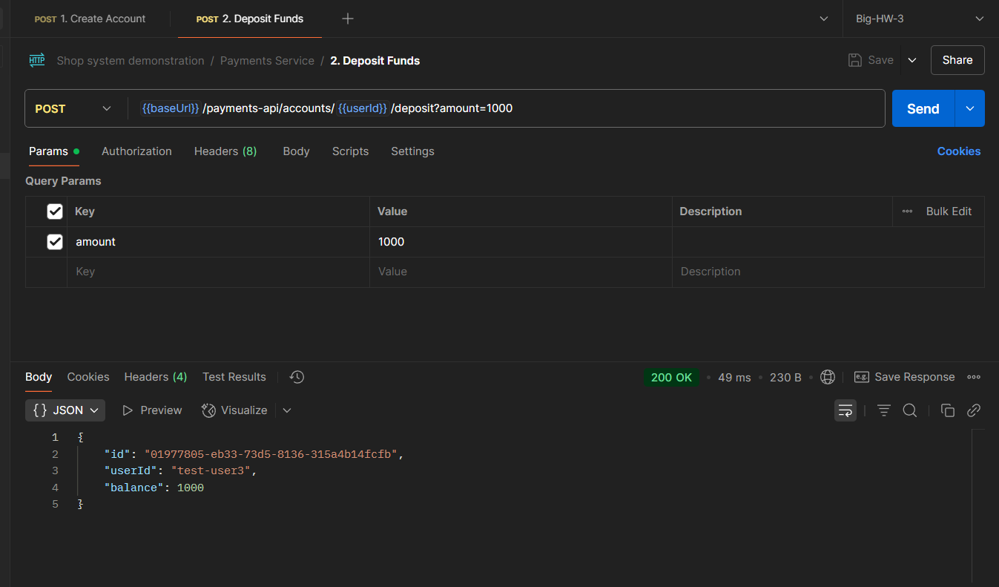
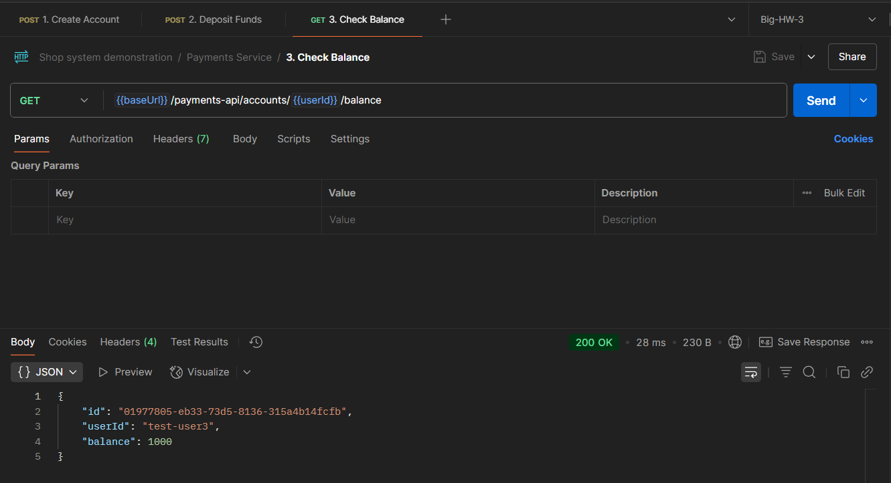
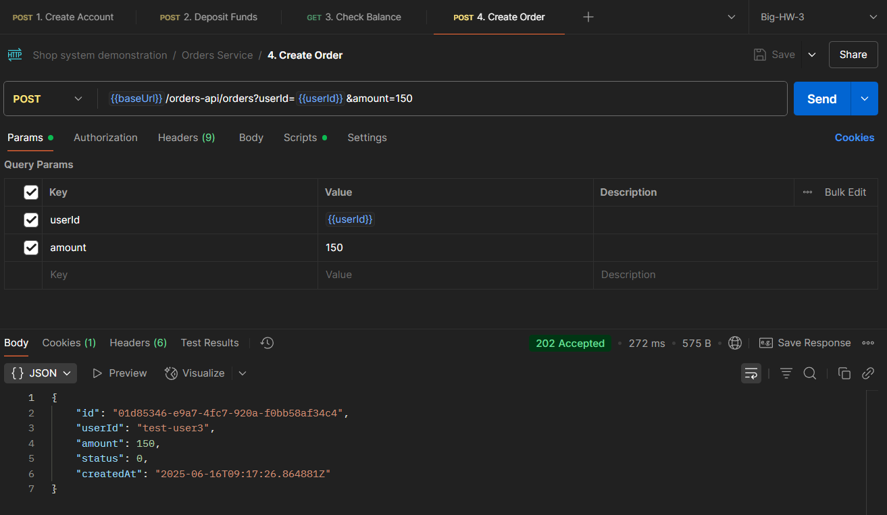
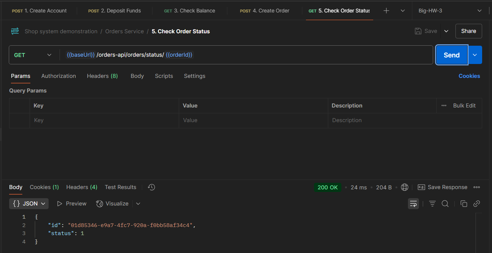

# Отчет о выполнении большого ДЗ №3 - асинхронное межсервисное взаимодействие by Пономарев Николай Юрьевич from БПИ-234

## Запуск проекта: `docker-compose up --build`, веб-приложение будет доступно по адресу `http://localhost:8082`
P.s. Брокер сообщений поднимается чуть дольше, поэтому после завершения билда нужно подождать ещё секунд 7-8.

## 1. Архитектура приложения

Система состоит из нескольких ключевых компонентов, развернутых в Docker-контейнерах.

* **Микросервисы**:
    * `ordersservice` - сервис для управления заказами.
    * `paymentsservice` - сервис для управления счетами и платежами.
    * `apigateway` - единая точка входа для всех клиентских запросов.
    * `frontend` - клиентское приложение для взаимодействия с системой.
* **Инфраструктура**:
    * `rabbitmq`- брокер сообщений для асинхронного взаимодействия между сервисами.
    * `ordersdb` - база данных PostgreSQL для `OrdersService`.
    * `paymentsdb` - база данных PostgreSQL для `PaymentsService`.

## 2. Описание микросервисов

### 2.1. Orders Service

Отвечает за всю логику, связанную с заказами. 

* **API**:
    * `POST /api/orders` - создание нового заказа.
    * `GET /api/orders/{userId}` - получение списка всех заказов пользователя.
    * `GET /api/orders/status/{orderId}` - получение статуса конкретного заказа.
    * `GET /ws` - WebSocket-эндпоинт для real-time уведомлений об изменении статуса заказа.
* **База данных (`ordersdb`)**:
    * **Orders** - таблица для хранения информации о заказах (`Id`, `UserId`, `Amount`, `Status`).
    * **Outbox** - таблица для реализации паттерна Transactional Outbox, что гарантирует доставку сообщения в `rabbitmq`.
* **Взаимодействие**:
    * При создании заказа, сервис сохраняет заказ и сообщение в базу данных в одной транзакции.
    * `OutboxWorker` периодически проверяет таблицу `Outbox` и отправляет сообщения в `rabbitmq`.
    * Подписывается на события из `PaymentsService` для обновления статусов заказов (`FINISHED` или `CANCELLED`).
    * Отправляет уведомления через WebSocket при изменении статуса заказа.

### 2.2. Payments Service

Отвечает за управление счетами пользователей и обработку платежей.

* **API**:
    * `POST /api/accounts` - создание счета для пользователя.
    * `POST /api/accounts/deposit` - пополнение счета.
    * `GET /api/accounts/{userId}` - получение информации о счете пользователя.
* **База данных (`paymentsdb`)**:
    * **Accounts** - таблица для хранения информации о счетах (`Id`, `UserId`, `Balance`).
    * **Inbox** - таблица для реализации паттерна Transactional Inbox, что гарантирует идемпотентную обработку входящих сообщений.
    * **Outbox** - таблица для гарантированной отправки результатов обработки платежа обратно в `OrdersService`.
* **Взаимодействие**:
    * Подписывается на события создания заказа из `OrdersService`.
    * Использует паттерн Transactional Inbox для надежной обработки входящих сообщений.
    * Обрабатывает платеж - проверяет наличие счета и достаточный баланс.
    * Использует паттерн Transactional Outbox для отправки события с результатом платежа (успех или неудача).

### 2.3. API Gateway

Единая точка входа, реализованная с помощью `YARP`. Маршрутизирует запросы к соответствующим микросервисам на основе пути запроса.

### 2.4. Frontend

Клиентское приложение, разработанное на Blazor WebAssembly. Предоставляет пользовательский интерфейс для:

* Создания счетов и пополнения баланса.
* Создания заказов.
* Получение их статусов в режиме реального времени с использованием WebSocket.

### 2.5. Документация API

Для документации была составлена Postman коллекция, охватывающая все API проекта. Доступна по ссылке (для запросов потребуется Postman Agent desktop): https://nikolai-9472511.postman.co/workspace/My-Workspace~377a9b36-ca9c-47b3-86ec-f3874add70f4/collection/45205272-11cc338c-d623-460a-911d-7cebdcf0bad4?action=share&creator=45205272&active-environment=45205272-149d6099-5fb3-4e46-aed5-60b9c0f795af

## 3. Демонстрация работы

### 3.1. Тестирование через Postman

Для демонстрации работы ключевого сценария можно использовать Postman.

1. **Создание счета**:
    * `POST http://localhost:8080/payments-api/accounts?userId=test-user`

2. **Пополнение счета**:
    * `POST http://localhost:8080/payments-api/accounts/deposit?userId=test-user&amount=1000`

3. **Получение баланса счёта**
    * `GET http://localhost:8080/payments-api/accounts/test-user/balance`

4. **Создание заказа**:
    * `POST http://localhost:8080/orders-api/orders?userId=test-user&amount=150`

5. **Проверка статуса заказа**:
    * `GET http://localhost:8080/orders-api/status/{orderId}`

### 3.2. Демонстрация Frontend (http://localhost:8082), если не запустится в браузере - demonstration.mp4 в папке media.
<video controls width="1920" height="1080">
  <source src="media/demonstration.mp4" type="video/mp4">
</video>

