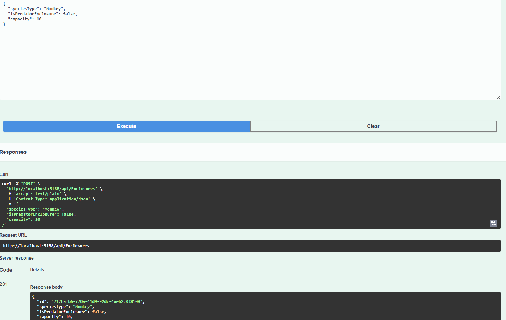

by Пономарев Николай from БПИ-234
## Описание решения:
Были реализованы следующие use-case:
1) Добавление новой сущности с соблюдением логики (вольер, животное, строка в расписании кормления), так, например нельзя добавить
в вольер с хищниками, травоядное животное. (`AnimalServices.cs`, `AnimalController.cs`, `Zoo.Application.Services`, `Zoo.Presentation.Controller` и т. д.)
2) Перемещение животного между вольерами, с соблюдением доп. логики (переместить животное можно только в вольер с животными того же вида).
3) Удаление сущности с соблюдением логики (например, нельзя удалить непустой вольер)
4) Получение статистики по зоопарку (общее кол-во животных, кол-во вольеров, кол-во пустых вольеров, кол-во вольеров с
наличием свободных мест, словарь животных по виду, словарь животных по их состоянию здоровья). (`ZooStatisticsService.cs`, `ZooStatisticsController.cs`)
## Описание архитектуры:

<b>Проект был создан с применением следующих строительных блоков и принципов DDD:</b>

1) Использование value-objects, например `Food.cs`, `FeedingStatus.cs`, `AnimalSpecies.cs` - для лучшего определения свойств главных доменных моделей.
2) Основные сущности, требуемые по условию задания, которые однозначно определяются благодаря своим уникальным Id - `Animal.cs`, `Enclosure.cs`, `FeedingSchedule.cs`
3) За события, произошедшие в доменной области отвечают следующие record'ы `AnimalAddedToEnclosureEvent`, `AnimalFedEvent` и т. д. в Zoo.Domain.Events
4) Классы и методы используют термины из предметной области.
5) Также были реализованы интерфейсы in-memory репозиториев для животных, вольеров и расписания в доменной области.

<b>Соблюдение принципов clean architecture отражено в следующих аспектах:</b>
1) Разделение приложения на 3 слоя
   1) `Zoo.Domain` - для сущностей и их бизнес-логики.
   2) `Zoo.Aplication` - для реализации сервисов и управления потоком данных.
   3) `Zoo.Presentation` - для реализации внешней API.
   4) `Zoo.Infrastructure` - для взаимодействия с внешними системами (в нашем случае репозиториями) (тот же слой с `Zoo.Infrastucture`).
2) Соблюдена зависимость снаружи внутрь (Domain слой независимый), это можно видеть по выставлению зависимостей между проектами в решении C#.
3) Никакой внутренний слой не знает о существовании внешнего.
## <b>Доп примечания:</b>
В проекте используется DI контейнер и написаны unit-тесты на Domain слой.
## Отчет о тестировании с помощью Swagger:
### Создание животного

### Получение животного

### Создание вольера

### Получение вольера по Id

### Вольер можно почистить (тогда поле LastCleanDate изменится на время вызова уборки)

### Добавление записи о будущем кормлении нашего монке

### Получение статистики по зоопарку

### Монке отправился в вольер
 
### Монке был удален из зоопарка =(

Если запустить `Zoo.Presentation/Program.cs`, то можно потыкать API с помощью Swagger ещё, здесь в отчете приведены далеко не все виды запросов.

that's all =)